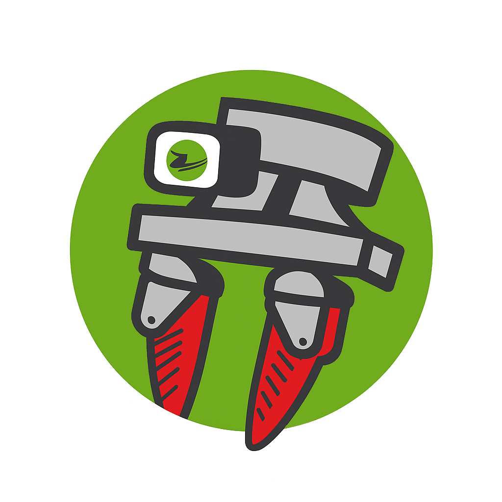

# Dynamixel-SDK Wrapper


A Python wrapper for the Dynamixel SDK that simplifies control of Dynamixel servo motors.

## ⭐ Getting Started

### Python

Use pip or uv:
```bash
pip install -e .
```
Alternatively use pixi:
```bash
pixi shell  # To create environment and enter in it
```

### ROS2

To broadcast the motor values and control a motor using ROS2, you can use the respective ROS2 environments:

```bash
pixi run -e humble dynamixel-motor-ros2 --namespace gripper --device /dev/ttyUSB1 --motor-id 0
```

In a different shell, check the topics
```bash
pixi run -e humble ros2 topic list
```

This should output:
```bash
...
/gripper/dynamixel_motor/command
/gripper/dynamixel_motor/joint_states
...

```

## 🎯 Motor Calibration

The calibration script automatically finds your motor's physical limits (stoppers, gripper ends, etc.) by moving it incrementally in both directions.

**Quick Start:**
```bash
pixi run calibrate-motor --device /dev/ttyUSB0 --motor-id 0
```

What it does 📊 Saves min/max values to `outputs/motor_X_calibration.yaml`
